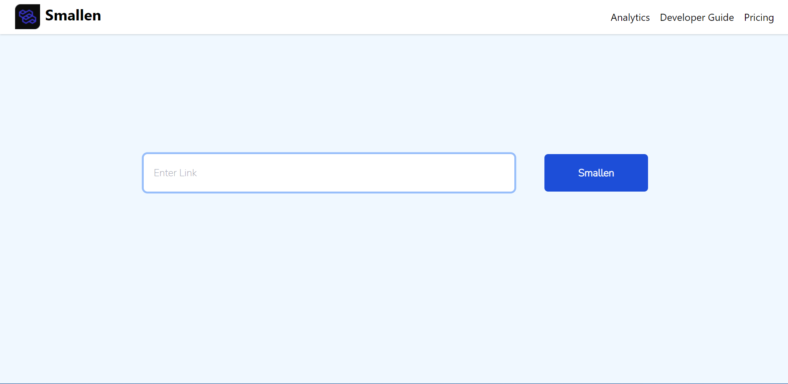

> Forget Humongous links and say hi to a simpler and easy to remember life
## Preview 📺


<div align="center">
  
</div>

## Smallen

Forget Humongous links and say hi to a simpler and easy to remember life

## License 📜

`Smallen` is available under the MIT license. See the [LICENSE.md](https://github.com/sbiswas2209/smallen/blob/main/LICENSE.md) file for more info.

## Shout outs 💥

| <p align="center"><br>[Sagnik Biswas](https://sagnikbiswas.tech)</p> |
| -------------------------------------------------------------------------------------------------------------------------------- | 

API routes : https://smallen.gitbook.io/smallen/

## Installation 🔧

Install dependencies

```
$ yarn
```

Build server

```
$ yarn build
```

Start the server

```
$ yarn start
```

Run in development mode

```
yarn dev
```

## API Documentation
- [Check Here](https://smallen.gitbook.io/smallen/)

## Live
- Check live project at [here](https://smallen.xyz)